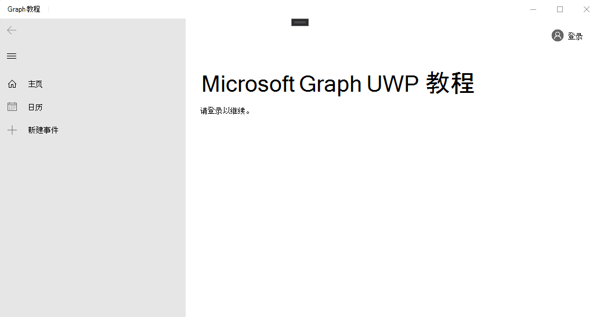

<!-- markdownlint-disable MD002 MD041 -->

<span data-ttu-id="644ee-101">在本节中，您将创建一个新的 UWP 应用程序。</span><span class="sxs-lookup"><span data-stu-id="644ee-101">In this section you'll create a new UWP app.</span></span>

1. <span data-ttu-id="644ee-102">打开 Visual Studio，然后选择 "**新建项目**"。</span><span class="sxs-lookup"><span data-stu-id="644ee-102">Open Visual Studio, and select **Create a new project**.</span></span> <span data-ttu-id="644ee-103">选择使用 c # 的**空白应用程序（通用窗口）** 选项，然后选择 "**下一步**"。</span><span class="sxs-lookup"><span data-stu-id="644ee-103">Choose the **Blank App (Universal Windows)** option that uses C#, then select **Next**.</span></span>

    

1. <span data-ttu-id="644ee-105">在 "**配置新项目**" 对话框中， `GraphTutorial`在 "**项目名称**" 字段中输入，然后选择 "**创建**"。</span><span class="sxs-lookup"><span data-stu-id="644ee-105">In the **Configure your new project** dialog, enter `GraphTutorial` in the **Project name** field and select **Create**.</span></span>

    

    > [!IMPORTANT]
    > <span data-ttu-id="644ee-107">确保为在这些实验室说明中指定的 Visual Studio 项目输入完全相同的名称。</span><span class="sxs-lookup"><span data-stu-id="644ee-107">Ensure that you enter the exact same name for the Visual Studio Project that is specified in these lab instructions.</span></span> <span data-ttu-id="644ee-108">Visual Studio 项目名称将成为代码中的命名空间的一部分。</span><span class="sxs-lookup"><span data-stu-id="644ee-108">The Visual Studio Project name becomes part of the namespace in the code.</span></span> <span data-ttu-id="644ee-109">这些指令中的代码取决于与这些说明中指定的 Visual Studio 项目名称匹配的命名空间。</span><span class="sxs-lookup"><span data-stu-id="644ee-109">The code inside these instructions depends on the namespace matching the Visual Studio Project name specified in these instructions.</span></span> <span data-ttu-id="644ee-110">如果使用其他项目名称，则代码将不会编译，除非您调整所有命名空间以匹配您在创建项目时输入的 Visual Studio 项目名称。</span><span class="sxs-lookup"><span data-stu-id="644ee-110">If you use a different project name the code will not compile unless you adjust all the namespaces to match the Visual Studio Project name you enter when you create the project.</span></span>

1. <span data-ttu-id="644ee-111">选择“确定”\*\*\*\*。</span><span class="sxs-lookup"><span data-stu-id="644ee-111">Select **OK**.</span></span> <span data-ttu-id="644ee-112">在 "**新建通用 Windows 平台项目**" 对话框中，确保将**最低版本**设置为`Windows 10, Version 1809 (10.0; Build 17763)`或更高，然后选择 **"确定"**。</span><span class="sxs-lookup"><span data-stu-id="644ee-112">In the **New Universal Windows Platform Project** dialog, ensure that the **Minimum version** is set to `Windows 10, Version 1809 (10.0; Build 17763)` or later and select **OK**.</span></span>

## <a name="install-nuget-packages"></a><span data-ttu-id="644ee-113">安装 NuGet 包</span><span class="sxs-lookup"><span data-stu-id="644ee-113">Install NuGet packages</span></span>

<span data-ttu-id="644ee-114">在继续之前，请安装稍后将使用的一些其他 NuGet 包。</span><span class="sxs-lookup"><span data-stu-id="644ee-114">Before moving on, install some additional NuGet packages that you will use later.</span></span>

- <span data-ttu-id="644ee-115">用于添加应用程序内通知和加载指示器的一些 UI 控件的[控件](https://www.nuget.org/packages/Microsoft.Toolkit.Uwp.Ui.Controls/)。</span><span class="sxs-lookup"><span data-stu-id="644ee-115">[Microsoft.Toolkit.Uwp.Ui.Controls](https://www.nuget.org/packages/Microsoft.Toolkit.Uwp.Ui.Controls/) to add some UI controls for in-app notifications and loading indicators.</span></span>
- <span data-ttu-id="644ee-116">[若要](https://www.nuget.org/packages/Microsoft.Toolkit.Uwp.Ui.Controls.DataGrid/)显示 microsoft Graph 返回的信息，则为。</span><span class="sxs-lookup"><span data-stu-id="644ee-116">[Microsoft.Toolkit.Uwp.Ui.Controls.DataGrid](https://www.nuget.org/packages/Microsoft.Toolkit.Uwp.Ui.Controls.DataGrid/) to display the information returned by Microsoft Graph.</span></span>
- <span data-ttu-id="644ee-117">用于处理登录和访问令牌检索的[Microsoft 工具包](https://www.nuget.org/packages/Microsoft.Toolkit.Graph.Controls)。</span><span class="sxs-lookup"><span data-stu-id="644ee-117">[Microsoft.Toolkit.Graph.Controls](https://www.nuget.org/packages/Microsoft.Toolkit.Graph.Controls) to handle login and access token retrieval.</span></span>

1. <span data-ttu-id="644ee-118">选择 "**工具" > NuGet 包管理器 "> 程序包管理器控制台**"。</span><span class="sxs-lookup"><span data-stu-id="644ee-118">Select **Tools > NuGet Package Manager > Package Manager Console**.</span></span> <span data-ttu-id="644ee-119">在 "程序包管理器控制台" 中，输入以下命令。</span><span class="sxs-lookup"><span data-stu-id="644ee-119">In the Package Manager Console, enter the following commands.</span></span>

    ```powershell
    Install-Package Microsoft.Toolkit.Uwp.Ui.Controls -Version 6.0.0
    Install-Package Microsoft.Toolkit.Uwp.Ui.Controls.DataGrid -Version 6.0.0
    Install-Package Microsoft.Toolkit.Graph.Controls -IncludePrerelease
    ```

## <a name="design-the-app"></a><span data-ttu-id="644ee-120">设计应用程序</span><span class="sxs-lookup"><span data-stu-id="644ee-120">Design the app</span></span>

<span data-ttu-id="644ee-121">在本节中，您将为应用程序创建 UI。</span><span class="sxs-lookup"><span data-stu-id="644ee-121">In this section you'll create the UI for the app.</span></span>

1. <span data-ttu-id="644ee-122">首先添加应用程序级变量以跟踪身份验证状态。</span><span class="sxs-lookup"><span data-stu-id="644ee-122">Start by adding an application-level variable to track authentication state.</span></span> <span data-ttu-id="644ee-123">在 "解决方案资源管理器" 中，展开**app.xaml**并打开**App.xaml.cs**。</span><span class="sxs-lookup"><span data-stu-id="644ee-123">In Solution Explorer, expand **App.xaml** and open **App.xaml.cs**.</span></span> <span data-ttu-id="644ee-124">将以下属性添加到`App`类中。</span><span class="sxs-lookup"><span data-stu-id="644ee-124">Add the following property to the `App` class.</span></span>

    ```csharp
    public bool IsAuthenticated { get; set; }
    ```

1. <span data-ttu-id="644ee-125">定义主页的布局。</span><span class="sxs-lookup"><span data-stu-id="644ee-125">Define the layout for the main page.</span></span> <span data-ttu-id="644ee-126">打开`MainPage.xaml`并将其全部内容替换为以下内容。</span><span class="sxs-lookup"><span data-stu-id="644ee-126">Open `MainPage.xaml` and replace its entire contents with the following.</span></span>

    :::code language="xaml" source="../demo/GraphTutorial/MainPage.xaml" id="MainPageXamlSnippet":::

    <span data-ttu-id="644ee-127">这将定义基本[NavigationView](/uwp/api/windows.ui.xaml.controls.navigationview) ，并使用**Home**和**Calendar**导航链接充当应用程序的主视图。</span><span class="sxs-lookup"><span data-stu-id="644ee-127">This defines a basic [NavigationView](/uwp/api/windows.ui.xaml.controls.navigationview) with **Home** and **Calendar** navigation links to act as the main view of the app.</span></span> <span data-ttu-id="644ee-128">此外，它还会在视图的标题中添加一个[LoginButton](https://github.com/windows-toolkit/Graph-Controls)控件。</span><span class="sxs-lookup"><span data-stu-id="644ee-128">It also adds a [LoginButton](https://github.com/windows-toolkit/Graph-Controls) control in the header of the view.</span></span> <span data-ttu-id="644ee-129">该控件将允许用户登录和注销。该控件尚未完全启用，你将在后续练习中对其进行配置。</span><span class="sxs-lookup"><span data-stu-id="644ee-129">That control will allow the user to sign in and out. The control isn't fully enabled yet, you will configure it in a later exercise.</span></span>

1. <span data-ttu-id="644ee-130">右键单击 "解决方案资源管理器" 中的 "**教程**" 项目，然后选择 "**添加 > 新项 ...**"。选择 "**空白页**" `HomePage.xaml` ，在 "**名称**" 字段中输入，然后选择 "**添加**"。</span><span class="sxs-lookup"><span data-stu-id="644ee-130">Right-click the **graph-tutorial** project in Solution Explorer and select **Add > New Item...**. Choose **Blank Page**, enter `HomePage.xaml` in the **Name** field, and select **Add**.</span></span> <span data-ttu-id="644ee-131">将文件中`<Grid>`的现有元素替换为以下项。</span><span class="sxs-lookup"><span data-stu-id="644ee-131">Replace the existing `<Grid>` element in the file with the following.</span></span>

    :::code language="xaml" source="../demo/GraphTutorial/HomePage.xaml" id="HomePageGridSnippet" highlight="2-5":::

1. <span data-ttu-id="644ee-132">展开**MainPage.xaml** "解决方案资源管理器" 中的`MainPage.xaml.cs`MainPage，然后打开。</span><span class="sxs-lookup"><span data-stu-id="644ee-132">Expand **MainPage.xaml** in Solution Explorer and open `MainPage.xaml.cs`.</span></span> <span data-ttu-id="644ee-133">将以下函数添加到`MainPage`类以管理身份验证状态。</span><span class="sxs-lookup"><span data-stu-id="644ee-133">Add the following function to the `MainPage` class to manage authentication state.</span></span>

    :::code language="csharp" source="../demo/GraphTutorial/MainPage.xaml.cs" id="SetAuthStateSnippet":::

1. <span data-ttu-id="644ee-134">将下面的代码添加到`MainPage()`构造函数中`this.InitializeComponent();`的行**后面**。</span><span class="sxs-lookup"><span data-stu-id="644ee-134">Add the following code to the `MainPage()` constructor **after** the `this.InitializeComponent();` line.</span></span>

    ```csharp
    // Initialize auth state to false
    SetAuthState(false);

    // Configure MSAL provider
    // TEMPORARY
    MsalProvider.ClientId = "11111111-1111-1111-1111-111111111111";

    // Navigate to HomePage.xaml
    RootFrame.Navigate(typeof(HomePage));
    ```

    <span data-ttu-id="644ee-135">当应用程序第一次启动时，它会将身份`false`验证状态初始化为并导航到主页。</span><span class="sxs-lookup"><span data-stu-id="644ee-135">When the app first starts, it will initialize the authentication state to `false` and navigate to the home page.</span></span>

1. <span data-ttu-id="644ee-136">添加以下事件处理程序，以便在用户从导航视图中选择项目时加载请求的页面。</span><span class="sxs-lookup"><span data-stu-id="644ee-136">Add the following event handler to load the requested page when the user selects an item from the navigation view.</span></span>

    ```csharp
    private void NavView_ItemInvoked(NavigationView sender, NavigationViewItemInvokedEventArgs args)
    {
        var invokedItem = args.InvokedItem as string;

        switch (invokedItem.ToLower())
        {
            case "calendar":
                throw new NotImplementedException();
                break;
            case "home":
            default:
                RootFrame.Navigate(typeof(HomePage));
                break;
        }
    }
    ```

1. <span data-ttu-id="644ee-137">保存所有更改，然后按**F5**或选择调试 > 在 Visual Studio 中**启动调试**。</span><span class="sxs-lookup"><span data-stu-id="644ee-137">Save all of your changes, then press **F5** or select **Debug > Start Debugging** in Visual Studio.</span></span>

    > [!NOTE]
    > <span data-ttu-id="644ee-138">确保为您的计算机选择适当的配置（ARM、x64、x86）。</span><span class="sxs-lookup"><span data-stu-id="644ee-138">Make sure you select the appropriate configuration for your machine (ARM, x64, x86).</span></span>

    
