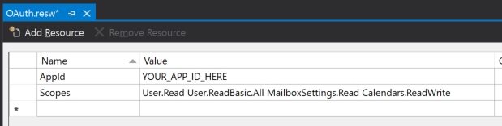

<!-- markdownlint-disable MD002 MD041 -->

<span data-ttu-id="63dfd-101">在本练习中，你将扩展上一练习中的应用程序，以支持 Azure AD 的身份验证。</span><span class="sxs-lookup"><span data-stu-id="63dfd-101">In this exercise you will extend the application from the previous exercise to support authentication with Azure AD.</span></span> <span data-ttu-id="63dfd-102">若要获取所需的 OAuth 访问令牌以调用 Microsoft Graph，这是必需的。</span><span class="sxs-lookup"><span data-stu-id="63dfd-102">This is required to obtain the necessary OAuth access token to call the Microsoft Graph.</span></span> <span data-ttu-id="63dfd-103">在此步骤中，将**LoginButton**控件从[Windows Graph 控件](https://github.com/windows-toolkit/Graph-Controls)集成到应用程序中。</span><span class="sxs-lookup"><span data-stu-id="63dfd-103">In this step you will integrate the **LoginButton** control from the [Windows Graph Controls](https://github.com/windows-toolkit/Graph-Controls) into the application.</span></span>

1. <span data-ttu-id="63dfd-104">在 "解决方案资源管理器" 中右键单击 " **GraphTutorial** " 项目，然后选择 "**添加 > 新项 ...**"。选择 "**资源文件（resources.resw）**"，命名该`OAuth.resw`文件，然后选择 "**添加**"。</span><span class="sxs-lookup"><span data-stu-id="63dfd-104">Right-click the **GraphTutorial** project in Solution Explorer and select **Add > New Item...**. Choose **Resources File (.resw)**, name the file `OAuth.resw` and select **Add**.</span></span> <span data-ttu-id="63dfd-105">在 Visual Studio 中打开新文件时，请按如下所示创建两个资源。</span><span class="sxs-lookup"><span data-stu-id="63dfd-105">When the new file opens in Visual Studio, create two resources as follows.</span></span>

    - <span data-ttu-id="63dfd-106">**Name：** `AppId`， **Value：** 您在应用程序注册门户中生成的应用程序 ID</span><span class="sxs-lookup"><span data-stu-id="63dfd-106">**Name:** `AppId`, **Value:** the app ID you generated in Application Registration Portal</span></span>
    - <span data-ttu-id="63dfd-107">**Name：** `Scopes`， **Value：**`User.Read Calendars.Read`</span><span class="sxs-lookup"><span data-stu-id="63dfd-107">**Name:** `Scopes`, **Value:** `User.Read Calendars.Read`</span></span>

    

    > [!IMPORTANT]
    > <span data-ttu-id="63dfd-109">如果您使用的是源代码管理（如 git），现在可以从源代码管理中排除`OAuth.resw`该文件，以避免无意中泄漏您的应用程序 ID。</span><span class="sxs-lookup"><span data-stu-id="63dfd-109">If you're using source control such as git, now would be a good time to exclude the `OAuth.resw` file from source control to avoid inadvertently leaking your app ID.</span></span>

## <a name="configure-the-loginbutton-control"></a><span data-ttu-id="63dfd-110">配置 LoginButton 控件</span><span class="sxs-lookup"><span data-stu-id="63dfd-110">Configure the LoginButton control</span></span>

1. <span data-ttu-id="63dfd-111">打开`MainPage.xaml.cs`并将以下`using`语句添加到文件顶部。</span><span class="sxs-lookup"><span data-stu-id="63dfd-111">Open `MainPage.xaml.cs` and add the following `using` statement to the top of the file.</span></span>

    ```csharp
    using Microsoft.Toolkit.Graph.Providers;
    ```

1. <span data-ttu-id="63dfd-112">将现有的构造函数替换为以下项。</span><span class="sxs-lookup"><span data-stu-id="63dfd-112">Replace the existing constructor with the following.</span></span>

    :::code language="csharp" source="../demo/GraphTutorial/MainPage.xaml.cs" id="ConstructorSnippet":::

    <span data-ttu-id="63dfd-113">此代码从`OAuth.resw`加载设置，并使用这些值初始化 MSAL 提供程序。</span><span class="sxs-lookup"><span data-stu-id="63dfd-113">This code loads the settings from `OAuth.resw` and initializes the MSAL provider with those values.</span></span>

1. <span data-ttu-id="63dfd-114">现在， `ProviderUpdated` `ProviderManager`在上添加事件的事件处理程序。</span><span class="sxs-lookup"><span data-stu-id="63dfd-114">Now add an event handler for the `ProviderUpdated` event on the `ProviderManager`.</span></span> <span data-ttu-id="63dfd-115">将以下函数添加到 `MainPage` 类。</span><span class="sxs-lookup"><span data-stu-id="63dfd-115">Add the following function to the `MainPage` class.</span></span>

    :::code language="csharp" source="../demo/GraphTutorial/MainPage.xaml.cs" id="ProviderUpdatedSnippet":::

    <span data-ttu-id="63dfd-116">当提供程序更改或提供程序状态更改时，此事件将触发。</span><span class="sxs-lookup"><span data-stu-id="63dfd-116">This event triggers when the provider changes, or when the provider state changes.</span></span>

1. <span data-ttu-id="63dfd-117">在 "解决方案资源管理器" 中，展开`HomePage.xaml.cs`"**主页. xaml** " 并打开。</span><span class="sxs-lookup"><span data-stu-id="63dfd-117">In Solution Explorer, expand **HomePage.xaml** and open `HomePage.xaml.cs`.</span></span> <span data-ttu-id="63dfd-118">将现有的构造函数替换为以下项。</span><span class="sxs-lookup"><span data-stu-id="63dfd-118">Replace the existing constructor with the following.</span></span>

    :::code language="csharp" source="../demo/GraphTutorial/HomePage.xaml.cs" id="ConstructorSnippet":::

1. <span data-ttu-id="63dfd-119">重新启动应用程序，并单击应用程序顶部的 "**登录**" 控件。</span><span class="sxs-lookup"><span data-stu-id="63dfd-119">Restart the app and click the **Sign In** control at the top of the app.</span></span> <span data-ttu-id="63dfd-120">登录后，UI 应更改，以指示您已成功登录。</span><span class="sxs-lookup"><span data-stu-id="63dfd-120">Once you've signed in, the UI should change to indicate that you've successfully signed-in.</span></span>

    

    > [!NOTE]
    > <span data-ttu-id="63dfd-122">该`ButtonLogin`控件实现为您存储和刷新访问令牌的逻辑。</span><span class="sxs-lookup"><span data-stu-id="63dfd-122">The `ButtonLogin` control implements the logic of storing and refreshing the access token for you.</span></span> <span data-ttu-id="63dfd-123">令牌存储在安全存储中并根据需要进行刷新。</span><span class="sxs-lookup"><span data-stu-id="63dfd-123">The tokens are stored in secure storage and refreshed as needed.</span></span>
